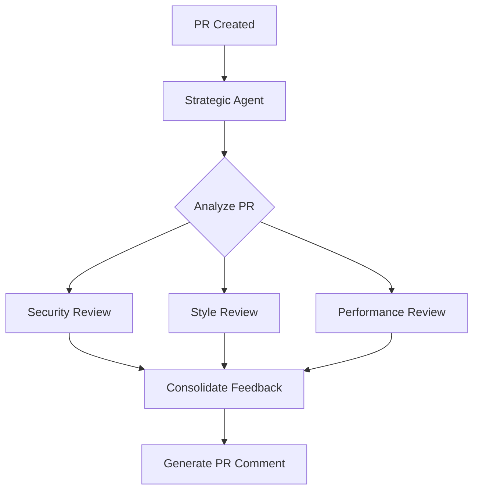

# Code Review Workflow Example

This example demonstrates a strategic agent orchestrating a code review process using multiple job agents.

## Workflow Overview



## Implementation

```typescript
// 1. Strategic Agent (Orchestrator)
class CodeReviewOrchestrator extends StrategicAgent {
  private controlPlane: ControlPlane;

  constructor(config: AgentConfig) {
    super(config);
    this.controlPlane = new ControlPlane({
      supabaseUrl: config.supabaseUrl,
      supabaseKey: config.supabaseKey
    });
  }

  async handlePullRequest(prDetails: {
    repo: string;
    prNumber: string;
    files: string[];
  }): Promise<void> {
    // Create workflow
    const workflowId = await this.controlPlane.enqueueWorkflow({
      orchestratorId: this.id,
      workflowType: 'code-review',
      priority: 'high',
      workflow: {
        type: 'parallel',
        steps: [
          {
            name: 'security-review',
            agentType: 'security-reviewer',
            input: prDetails
          },
          {
            name: 'style-review',
            agentType: 'style-reviewer',
            input: prDetails
          },
          {
            name: 'performance-review',
            agentType: 'performance-reviewer',
            input: prDetails
          }
        ],
        consolidation: {
          type: 'sequential',
          steps: [
            {
              name: 'feedback-consolidation',
              agentType: 'feedback-consolidator',
              input: {
                prDetails,
                reviewResults: '${steps.*.output}'
              }
            }
          ]
        }
      }
    });

    // Monitor workflow progress
    this.controlPlane.subscribeToWorkflowUpdates(
      this.id,
      async (workflow) => {
        if (workflow.id === workflowId) {
          console.log('Workflow update:', workflow.status);
          
          if (workflow.status === 'completed') {
            await this.handleCompletedReview(
              prDetails,
              workflow.result
            );
          }
        }
      }
    );
  }

  private async handleCompletedReview(
    prDetails: any,
    reviewResults: any
  ): Promise<void> {
    // Create PR comment task
    await this.controlPlane.enqueueTask({
      agentId: 'github-commenter-agent',
      taskType: 'create-pr-comment',
      priority: 'high',
      payload: {
        repo: prDetails.repo,
        prNumber: prDetails.prNumber,
        comment: reviewResults.comment
      }
    });
  }
}

// 2. Security Review Agent
class SecurityReviewAgent extends JobAgent {
  async processTask(task: Task): Promise<TaskResult> {
    const { files } = task.input;
    
    // Analyze security issues
    const issues = await this.analyzeSecurity(files);
    
    return {
      type: 'security-review',
      issues,
      riskLevel: this.calculateRiskLevel(issues)
    };
  }
}

// 3. Style Review Agent
class StyleReviewAgent extends JobAgent {
  async processTask(task: Task): Promise<TaskResult> {
    const { files } = task.input;
    
    // Check code style
    const styleIssues = await this.checkStyle(files);
    
    return {
      type: 'style-review',
      issues: styleIssues,
      suggestions: this.generateSuggestions(styleIssues)
    };
  }
}

// 4. Performance Review Agent
class PerformanceReviewAgent extends JobAgent {
  async processTask(task: Task): Promise<TaskResult> {
    const { files } = task.input;
    
    // Analyze performance
    const perfIssues = await this.analyzePerformance(files);
    
    return {
      type: 'performance-review',
      issues: perfIssues,
      recommendations: this.generateRecommendations(perfIssues)
    };
  }
}

// 5. Feedback Consolidation Agent
class FeedbackConsolidationAgent extends JobAgent {
  async processTask(task: Task): Promise<TaskResult> {
    const { prDetails, reviewResults } = task.input;
    
    // Consolidate feedback
    const consolidatedFeedback = await this.consolidateFeedback(
      reviewResults
    );
    
    return {
      type: 'consolidated-review',
      comment: this.formatPRComment(consolidatedFeedback)
    };
  }
}

// Example Usage
const orchestrator = new CodeReviewOrchestrator({
  id: 'code-review-orchestrator',
  type: 'strategic',
  capabilities: ['code-review-orchestration']
});

// GitHub webhook handler
app.post('/webhook/github', async (req, res) => {
  const { pull_request } = req.body;
  
  await orchestrator.handlePullRequest({
    repo: pull_request.base.repo.full_name,
    prNumber: pull_request.number,
    files: await getChangedFiles(pull_request)
  });
  
  res.status(200).send('Processing');
});
```

## Queue Configuration

```typescript
// Queue priorities for different PR types
const queueConfig = {
  priorities: {
    securityFix: 'critical',
    bugFix: 'high',
    feature: 'medium',
    documentation: 'low'
  },
  
  retryConfig: {
    maxRetries: 3,
    backoffMultiplier: 1.5
  }
};

// Determine PR priority
function getPRPriority(pr: any): TaskPriority {
  if (pr.labels.includes('security')) {
    return queueConfig.priorities.securityFix;
  }
  if (pr.labels.includes('bug')) {
    return queueConfig.priorities.bugFix;
  }
  // etc.
}
```

## Monitoring

```typescript
// Monitor workflow progress
async function monitorWorkflow(workflowId: string) {
  const metrics = {
    startTime: Date.now(),
    stepDurations: new Map<string, number>(),
    errors: [] as Error[],
  };

  controlPlane.subscribeToWorkflowUpdates(
    orchestratorId,
    (workflow) => {
      if (workflow.id === workflowId) {
        // Track step completion
        workflow.steps.forEach(step => {
          if (step.completedAt && !metrics.stepDurations.has(step.name)) {
            metrics.stepDurations.set(
              step.name,
              Date.now() - metrics.startTime
            );
          }
        });

        // Track errors
        if (workflow.error) {
          metrics.errors.push(workflow.error);
        }

        // Log progress
        console.log('Workflow Progress:', {
          id: workflowId,
          status: workflow.status,
          completedSteps: workflow.steps.filter(s => s.completedAt).length,
          totalSteps: workflow.steps.length,
          duration: Date.now() - metrics.startTime,
          errors: metrics.errors.length
        });
      }
    }
  );
}
```

## Error Handling

```typescript
class WorkflowError extends Error {
  constructor(
    message: string,
    public workflowId: string,
    public stepName: string,
    public context: unknown
  ) {
    super(message);
    this.name = 'WorkflowError';
  }
}

async function handleWorkflowError(error: WorkflowError) {
  // Log error
  console.error('Workflow Error:', {
    workflowId: error.workflowId,
    step: error.stepName,
    error: error.message,
    context: error.context
  });

  // Notify team
  await notifyTeam(error);

  // Attempt recovery
  if (error.stepName === 'security-review') {
    // Priority escalation
    await controlPlane.updateWorkflowPriority(
      error.workflowId,
      'critical'
    );
  }

  // Update workflow status
  await controlPlane.updateWorkflowStatus(
    error.workflowId,
    'error',
    {
      error: error.message,
      recovery: 'attempted',
      timestamp: new Date()
    }
  );
}
```

## Best Practices

1. **Workflow Design**
   - Break down complex tasks into smaller, manageable steps
   - Use parallel processing when possible
   - Include validation steps
   - Handle partial failures gracefully

2. **Queue Management**
   - Set appropriate priorities
   - Configure reasonable timeouts
   - Implement retry strategies
   - Monitor queue depths

3. **Error Handling**
   - Implement comprehensive error tracking
   - Use structured error types
   - Include context in error reports
   - Have recovery strategies

4. **Monitoring**
   - Track workflow progress
   - Measure step durations
   - Monitor resource usage
   - Set up alerts for anomalies