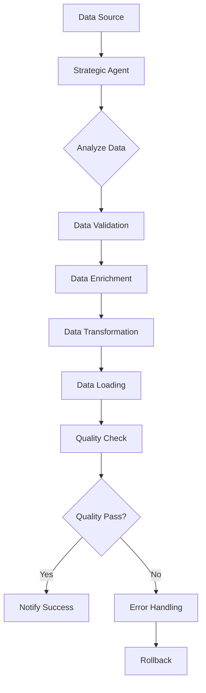

# Data Pipeline Workflow Example

This example demonstrates a strategic agent orchestrating a data processing pipeline using multiple specialized job agents.

## Workflow Overview



## Implementation

```typescript
// 1. Strategic Agent (Data Pipeline Orchestrator)
class DataPipelineOrchestrator extends StrategicAgent {
  private controlPlane: ControlPlane;

  constructor(config: AgentConfig) {
    super(config);
    this.controlPlane = new ControlPlane({
      supabaseUrl: config.supabaseUrl,
      supabaseKey: config.supabaseKey
    });
  }

  async processBatch(batchDetails: {
    sourceId: string;
    batchId: string;
    dataType: string;
    size: number;
  }): Promise<void> {
    // Create workflow
    const workflowId = await this.controlPlane.enqueueWorkflow({
      orchestratorId: this.id,
      workflowType: 'data-pipeline',
      priority: this.determinePriority(batchDetails),
      workflow: {
        type: 'sequential',
        steps: [
          {
            name: 'data-validation',
            agentType: 'data-validator',
            input: batchDetails,
            retryConfig: {
              maxRetries: 3,
              backoffMultiplier: 1.5
            }
          },
          {
            name: 'data-enrichment',
            agentType: 'data-enricher',
            input: {
              batchId: batchDetails.batchId,
              validationResult: '${steps.data-validation.output}'
            }
          },
          {
            name: 'data-transformation',
            agentType: 'data-transformer',
            input: {
              batchId: batchDetails.batchId,
              enrichedData: '${steps.data-enrichment.output}'
            }
          },
          {
            name: 'data-loading',
            agentType: 'data-loader',
            input: {
              batchId: batchDetails.batchId,
              transformedData: '${steps.data-transformation.output}'
            }
          },
          {
            name: 'quality-check',
            agentType: 'quality-checker',
            input: {
              batchId: batchDetails.batchId,
              loadResult: '${steps.data-loading.output}'
            }
          }
        ],
        errorHandling: {
          type: 'rollback',
          steps: [
            {
              name: 'rollback',
              agentType: 'rollback-handler',
              input: {
                batchId: batchDetails.batchId,
                failedStep: '${error.step}',
                error: '${error}'
              }
            }
          ]
        }
      }
    });

    // Monitor workflow progress
    this.controlPlane.subscribeToWorkflowUpdates(
      this.id,
      async (workflow) => {
        if (workflow.id === workflowId) {
          await this.handleWorkflowUpdate(workflow);
        }
      }
    );
  }

  private determinePriority(batchDetails: any): TaskPriority {
    if (batchDetails.size > 1000000) return 'high';
    if (batchDetails.dataType === 'real-time') return 'critical';
    return 'medium';
  }

  private async handleWorkflowUpdate(workflow: any): Promise<void> {
    switch (workflow.status) {
      case 'completed':
        await this.notifySuccess(workflow);
        break;
      case 'failed':
        await this.handleFailure(workflow);
        break;
    }
  }
}

// 2. Data Validation Agent
class DataValidationAgent extends JobAgent {
  async processTask(task: Task): Promise<TaskResult> {
    const { batchId, dataType } = task.input;
    
    // Validate data
    const validationResult = await this.validateData(batchId, dataType);
    
    if (!validationResult.valid) {
      throw new ValidationError(validationResult.errors);
    }
    
    return {
      type: 'validation-result',
      valid: true,
      schema: validationResult.schema,
      stats: validationResult.stats
    };
  }
}

// 3. Data Enrichment Agent
class DataEnrichmentAgent extends JobAgent {
  async processTask(task: Task): Promise<TaskResult> {
    const { batchId, validationResult } = task.input;
    
    // Enrich data
    const enrichedData = await this.enrichData(batchId);
    
    return {
      type: 'enrichment-result',
      enrichedFields: enrichedData.fields,
      coverage: enrichedData.coverage
    };
  }
}

// 4. Data Transformation Agent
class DataTransformationAgent extends JobAgent {
  async processTask(task: Task): Promise<TaskResult> {
    const { batchId, enrichedData } = task.input;
    
    // Transform data
    const transformedData = await this.transformData(
      batchId,
      enrichedData
    );
    
    return {
      type: 'transformation-result',
      schema: transformedData.schema,
      rowCount: transformedData.rowCount
    };
  }
}

// Example Usage
const orchestrator = new DataPipelineOrchestrator({
  id: 'data-pipeline-orchestrator',
  type: 'strategic',
  capabilities: ['data-pipeline-orchestration']
});

// Data ingestion endpoint
app.post('/ingest', async (req, res) => {
  const { sourceId, batchId, dataType, size } = req.body;
  
  await orchestrator.processBatch({
    sourceId,
    batchId,
    dataType,
    size
  });
  
  res.status(202).send('Processing');
});
```

## Queue Configuration

```typescript
// Queue configuration for data pipeline
const pipelineQueueConfig = {
  priorities: {
    realTime: 'critical',
    largeBatch: 'high',
    normalBatch: 'medium',
    historicalData: 'low'
  },
  
  timeouts: {
    validation: 300,    // 5 minutes
    enrichment: 1800,   // 30 minutes
    transformation: 900 // 15 minutes
  },
  
  retryConfig: {
    validation: {
      maxRetries: 3,
      backoffMultiplier: 1.5
    },
    enrichment: {
      maxRetries: 2,
      backoffMultiplier: 2
    }
  }
};

// Queue monitoring
interface PipelineMetrics {
  batchesProcessed: number;
  averageProcessingTime: number;
  failureRate: number;
  queueDepth: number;
  agentUtilization: Record<string, number>;
}

async function monitorPipeline(
  orchestratorId: string
): Promise<PipelineMetrics> {
  const metrics = await controlPlane.getQueueMetrics(orchestratorId);
  
  return {
    batchesProcessed: metrics.completedTasks,
    averageProcessingTime: metrics.avgProcessingTime,
    failureRate: metrics.failedTasks / 
      (metrics.completedTasks + metrics.failedTasks),
    queueDepth: metrics.pendingTasks,
    agentUtilization: {
      validator: metrics.processingTasks / metrics.maxConcurrent,
      enricher: metrics.processingTasks / metrics.maxConcurrent,
      transformer: metrics.processingTasks / metrics.maxConcurrent
    }
  };
}
```

## Error Handling

```typescript
class PipelineError extends Error {
  constructor(
    message: string,
    public batchId: string,
    public step: string,
    public context: unknown
  ) {
    super(message);
    this.name = 'PipelineError';
  }
}

async function handlePipelineError(error: PipelineError) {
  // Log error
  console.error('Pipeline Error:', {
    batchId: error.batchId,
    step: error.step,
    error: error.message,
    context: error.context
  });

  // Initiate rollback
  await controlPlane.enqueueTask({
    agentId: 'rollback-agent',
    taskType: 'rollback',
    priority: 'critical',
    payload: {
      batchId: error.batchId,
      step: error.step,
      error: error.message
    }
  });

  // Update metrics
  await updateErrorMetrics(error);

  // Notify stakeholders
  await notifyPipelineError(error);
}
```

## Best Practices

1. **Data Pipeline Design**
   - Validate data early
   - Use incremental processing
   - Implement checkpoints
   - Enable rollback capabilities

2. **Queue Management**
   - Prioritize real-time data
   - Set appropriate timeouts
   - Configure retries with backoff
   - Monitor queue health

3. **Resource Management**
   - Scale agents based on queue depth
   - Balance load across agents
   - Monitor resource utilization
   - Implement circuit breakers

4. **Error Recovery**
   - Implement comprehensive rollback
   - Maintain data consistency
   - Track failed records
   - Enable manual intervention

5. **Monitoring**
   - Track pipeline metrics
   - Monitor data quality
   - Alert on anomalies
   - Maintain audit logs