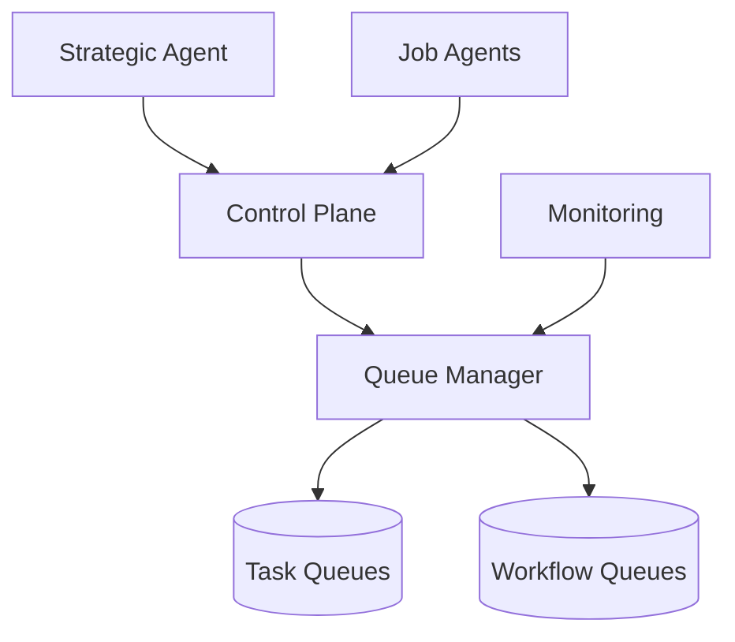

# Queue System Documentation

## Overview

The Squad queue system provides a robust infrastructure for managing tasks and workflows across strategic and job agents. It supports:

1. **Task Queues**: For individual job agents
2. **Workflow Queues**: For orchestrator/strategic agents
3. **Priority-based Processing**: Critical to low priority handling
4. **Real-time Monitoring**: Queue metrics and health
5. **Error Recovery**: Retry mechanisms and failure handling

## Architecture



## Queue Types

### 1. Task Queues
For specific, atomic tasks handled by job agents.

```typescript
interface TaskQueue {
  id: string;
  agentId: string;
  taskType: string;
  priority: 'critical' | 'high' | 'medium' | 'low';
  status: 'pending' | 'processing' | 'completed' | 'failed';
  payload: Record<string, unknown>;
  metadata: Record<string, unknown>;
  retryCount: number;
  maxRetries: number;
  scheduledFor: Date;
}
```

### 2. Workflow Queues
For complex workflows managed by strategic agents.

```typescript
interface WorkflowQueue {
  id: string;
  orchestratorId: string;
  workflowType: string;
  priority: 'critical' | 'high' | 'medium' | 'low';
  status: 'pending' | 'processing' | 'completed' | 'failed';
  workflow: {
    steps: WorkflowStep[];
    errorHandling?: ErrorHandlingConfig;
  };
  metadata: Record<string, unknown>;
  subTasks: Record<string, unknown>[];
}
```

## Queue Operations

### 1. Task Enqueuing
```typescript
// Enqueue a task
const taskId = await controlPlane.enqueueTask({
  agentId: 'job-agent-1',
  taskType: 'data-processing',
  priority: 'high',
  payload: {
    dataUrl: 'https://...',
    format: 'csv'
  }
});
```

### 2. Workflow Enqueuing
```typescript
// Enqueue a workflow
const workflowId = await controlPlane.enqueueWorkflow({
  orchestratorId: 'strategic-agent-1',
  workflowType: 'data-pipeline',
  priority: 'medium',
  workflow: {
    steps: [
      {
        name: 'validation',
        agentType: 'validator',
        input: { ... }
      },
      // More steps...
    ]
  }
});
```

### 3. Task Processing
```typescript
// Process next task
const task = await controlPlane.getNextTask(
  agentId,
  ['data-processing', 'data-validation']
);

if (task) {
  try {
    const result = await processTask(task);
    await controlPlane.completeTask(task.id, result);
  } catch (error) {
    await controlPlane.failTask(task.id, error);
  }
}
```

### 4. Workflow Processing
```typescript
// Process workflow
const workflow = await controlPlane.getNextWorkflow(
  orchestratorId,
  ['data-pipeline']
);

if (workflow) {
  try {
    const result = await processWorkflow(workflow);
    await controlPlane.completeWorkflow(workflow.id, result);
  } catch (error) {
    await controlPlane.failWorkflow(workflow.id, error);
  }
}
```

## Priority Management

### 1. Priority Levels
```typescript
type TaskPriority = 'critical' | 'high' | 'medium' | 'low';

const priorityConfig = {
  critical: {
    maxWaitTime: 60,    // seconds
    retryInterval: 5,   // seconds
    maxRetries: 5
  },
  high: {
    maxWaitTime: 300,   // 5 minutes
    retryInterval: 30,  // 30 seconds
    maxRetries: 3
  },
  // etc.
};
```

### 2. Priority Assignment
```typescript
function assignPriority(task: Task): TaskPriority {
  if (task.metadata.urgent) return 'critical';
  if (task.type === 'security-scan') return 'high';
  if (task.metadata.batchSize > 1000) return 'high';
  return 'medium';
}
```

## Error Handling

### 1. Retry Configuration
```typescript
interface RetryConfig {
  maxRetries: number;
  backoffMultiplier: number;
  initialDelay: number;
}

const retryConfig: RetryConfig = {
  maxRetries: 3,
  backoffMultiplier: 1.5,
  initialDelay: 1000
};
```

### 2. Error Recovery
```typescript
async function handleTaskError(
  task: Task,
  error: Error
): Promise<void> {
  if (task.retryCount < retryConfig.maxRetries) {
    // Schedule retry
    const delay = retryConfig.initialDelay * 
      Math.pow(retryConfig.backoffMultiplier, task.retryCount);
    
    await controlPlane.retryTask(task.id, {
      delay,
      error: error.message
    });
  } else {
    // Mark as failed
    await controlPlane.failTask(task.id, error);
  }
}
```

## Monitoring

### 1. Queue Metrics
```typescript
interface QueueMetrics {
  pendingTasks: number;
  processingTasks: number;
  failedTasks: number;
  completedTasks: number;
  retryingTasks: number;
  avgProcessingTime: number;
  criticalTasks: number;
  highPriorityTasks: number;
}
```

### 2. Health Checks
```typescript
async function checkQueueHealth(): Promise<HealthStatus> {
  const metrics = await controlPlane.getQueueMetrics(agentId);
  
  return {
    healthy: metrics.pendingTasks < 1000 &&
             metrics.failedTasks / metrics.completedTasks < 0.1,
    metrics,
    lastCheck: new Date()
  };
}
```

## Best Practices

1. **Queue Management**
   - Set appropriate priorities
   - Configure reasonable timeouts
   - Implement retry strategies
   - Monitor queue depths

2. **Error Handling**
   - Use exponential backoff
   - Set maximum retry limits
   - Log detailed error context
   - Implement circuit breakers

3. **Performance**
   - Batch similar tasks
   - Use appropriate indexes
   - Monitor queue latency
   - Scale based on depth

4. **Monitoring**
   - Track queue metrics
   - Set up alerts
   - Monitor resource usage
   - Log queue operations

## Common Issues

1. **Queue Buildup**
   ```typescript
   // Monitor queue depth
   if (metrics.pendingTasks > threshold) {
     // Scale up processors
     await scaleAgents(agentType, instanceCount + 1);
   }
   ```

2. **Stuck Tasks**
   ```typescript
   // Clean up stuck tasks
   async function cleanupStuckTasks(): Promise<void> {
     const stuckTasks = await findStuckTasks();
     for (const task of stuckTasks) {
       await controlPlane.retryTask(task.id);
     }
   }
   ```

3. **Priority Inversion**
   ```typescript
   // Prevent priority inversion
   function shouldPreempt(
     currentTask: Task,
     newTask: Task
   ): boolean {
     return getPriorityScore(newTask) > 
            getPriorityScore(currentTask) * 1.5;
   }
   ```

## Maintenance

1. **Queue Cleanup**
   ```typescript
   // Regular cleanup
   async function maintainQueues(): Promise<void> {
     await Promise.all([
       cleanupCompletedTasks(7),  // Older than 7 days
       retryFailedTasks(24),      // Last 24 hours
       consolidateMetrics()
     ]);
   }
   ```

2. **Performance Tuning**
   ```typescript
   // Optimize queue performance
   async function optimizeQueues(): Promise<void> {
     await Promise.all([
       vacuumTables(),
       updateStatistics(),
       reindexTables()
     ]);
   }
   ```