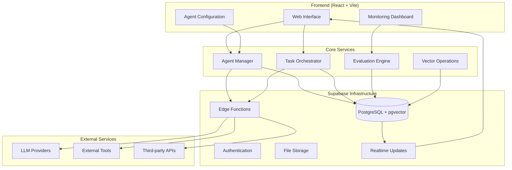
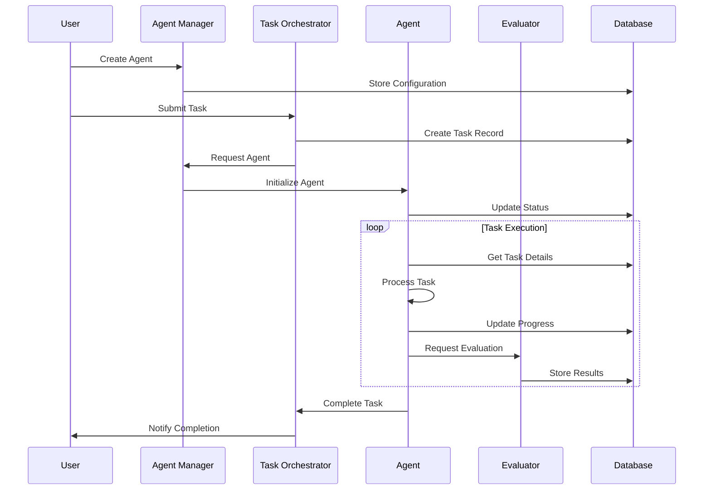
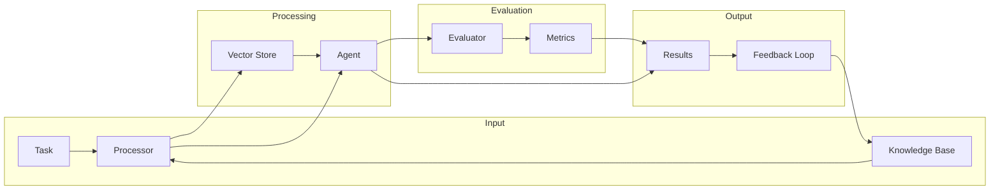

# Squad - AI Agent Management Platform

Squad is a platform for creating, managing, and evaluating AI agents with human-in-the-loop capabilities. It provides tools for agent orchestration, task management, and performance analytics.

## Repository Structure

```
squad/
├── apps/
│   ├── web/              # React frontend application
│   └── docs/             # Documentation site (future)
│
├── packages/
│   ├── core/             # Core types and evaluation framework
│   │   ├── src/
│   │   │   ├── evaluation/  # Evaluation framework
│   │   │   └── types/      # Shared type definitions
│   │   └── tests/
│   │
│   ├── agents/           # Agent implementations
│   │   ├── src/
│   │   │   ├── base-agent.ts
│   │   │   └── task-agent/
│   │   └── tests/
│   │
│   └── integrations/     # External integrations
│       ├── src/
│       │   └── supabase/   # Supabase client & repositories
│       └── tests/
│
├── supabase/
│   ├── functions/        # Edge Functions
│   ├── migrations/       # Database migrations
│   └── seed/            # Initial data
│
└── .ai/                  # AI development context
    ├── context/          # Project documentation
    └── sessions/         # Development session logs
```

## Architecture Overview

### System Architecture



### Agent Workflow



### Data Flow



### Infrastructure (Supabase)

Squad leverages Supabase as its primary infrastructure platform, providing:

1. **Vector Operations & AI Features**
```typescript
interface SupabaseAICapabilities {
  vectorStore: {
    storage: pgvector;        // Built-in pgvector support
    indexes: {
      ivfflat: IVFIndex;     // For larger datasets
      hnsw: HNSWIndex;       // For faster retrieval
    };
  };
  integrations: {
    langchain: LangChainVectorStore;
    llamaindex: LlamaIndexVectorStore;
    openai: OpenAIIntegration;
    huggingface: HuggingFaceIntegration;
  };
}
```

2. **Runtime & Compute**
```typescript
interface SupabaseCompute {
  edgeFunctions: {
    runtimes: {
      deno: DenoRuntime;     // For Edge Functions
      python: PythonRuntime;  // Via Python Client
    };
    features: {
      websockets: boolean;    // Real-time capabilities
      backgroundTasks: boolean;
      streaming: boolean;
    };
  };
}
```

3. **Storage & Database**
```typescript
interface SupabaseStorage {
  database: {
    postgres: PostgreSQL;
    realtime: RealtimeSubscriptions;
    rls: RowLevelSecurity;
  };
  storage: {
    buckets: StorageBucket[];
    cdn: CDNIntegration;
  };
}
```

### Core Architecture

The platform is built around these key components:

1. **Agent Framework**
```typescript
interface AgentDefinition {
  type: string;
  capabilities: AgentCapability[];
  tools: Tool[];
  knowledgeBase?: {
    documents?: Document[];
    embeddings?: Embedding[];
    vectorStore?: VectorStore;
  };
  prompts: {
    system?: string;
    task?: string;
    error?: string;
  };
  constraints: {
    maxTokens?: number;
    temperature?: number;
    costLimit?: number;
    timeLimit?: number;
  };
}
```

2. **Task Management**
```typescript
interface TaskDefinition {
  type: string;
  requirements: {
    capabilities: string[];
    tools: string[];
    priority?: 'low' | 'medium' | 'high';
    deadline?: Date;
  };
  workflow?: {
    steps?: TaskStep[];
    fallback?: TaskStep[];
    validation?: ValidationRule[];
  };
}
```

3. **Evaluation Framework**
```typescript
interface EvaluationCriteria {
  accuracy: number;
  relevance: number;
  businessValue: {
    costEfficiency: number;
    timeEfficiency: number;
    qualityScore: number;
  };
  domainAccuracy: {
    technicalPrecision: number;
    industryCompliance: number;
  };
}
```

## Database Schema

Our database is designed to support vector operations and efficient agent management:

```sql
-- Agent configuration and state
CREATE TABLE agents (
    id UUID PRIMARY KEY DEFAULT gen_random_uuid(),
    name TEXT NOT NULL,
    type TEXT NOT NULL,
    model TEXT NOT NULL,
    parameters JSONB NOT NULL DEFAULT '{}',
    metadata JSONB
);

-- Vector storage for agent knowledge
CREATE TABLE agent_embeddings (
    id UUID PRIMARY KEY DEFAULT gen_random_uuid(),
    agent_id UUID NOT NULL REFERENCES agents(id),
    content TEXT NOT NULL,
    embedding vector(1536),
    metadata JSONB
);

-- Task management
CREATE TABLE tasks (
    id UUID PRIMARY KEY DEFAULT gen_random_uuid(),
    title TEXT NOT NULL,
    status TEXT NOT NULL,
    priority TEXT NOT NULL,
    agent_id UUID REFERENCES agents(id),
    metadata JSONB
);
```

## Getting Started

### Prerequisites

Before you begin, ensure you have the following installed:
- [Node.js](https://nodejs.org/) >= 18
- [pnpm](https://pnpm.io/installation) (recommended) or npm
- [Supabase CLI](https://supabase.com/docs/guides/cli)
- [Docker](https://docs.docker.com/get-docker/) (for local Supabase development)

### Environment Setup

1. **Clone the repository:**
   ```bash
   git clone https://github.com/yourusername/squad.git
   cd squad
   ```

2. **Install dependencies:**
   ```bash
   pnpm install
   ```

3. **Set up Supabase:**
   ```bash
   # Initialize Supabase
   supabase init

   # Start Supabase services
   supabase start

   # Apply database migrations
   supabase db reset

   # Load sample data (optional)
   supabase db reset --seed
   ```

4. **Configure environment variables:**
   ```bash
   # Copy the example env file
   cp .env.example .env

   # Update with your Supabase credentials (shown after supabase start)
   # SUPABASE_URL=your_supabase_url
   # SUPABASE_ANON_KEY=your_anon_key
   # SUPABASE_SERVICE_ROLE_KEY=your_service_role_key
   ```

5. **Start the development servers:**
   ```bash
   # Start all services
   pnpm dev

   # Or start specific services
   pnpm --filter web dev        # Start web UI
   pnpm --filter docs dev       # Start documentation site
   ```

### Development Workflow

#### Running Tests
```bash
# Run all tests
pnpm test

# Run tests for specific package
pnpm --filter @squad/core test
pnpm --filter @squad/agents test

# Run tests in watch mode
pnpm test:watch
```

#### Building Packages
```bash
# Build all packages
pnpm build

# Build specific package
pnpm --filter @squad/core build
```

#### Code Quality
```bash
# Run linting
pnpm lint

# Fix linting issues
pnpm lint:fix

# Type checking
pnpm type-check
```

### Project Structure

Each package in the monorepo has its own development workflow:

#### Core Package
```bash
cd packages/core
pnpm dev        # Watch mode for development
pnpm build      # Build the package
pnpm test       # Run tests
```

#### Agents Package
```bash
cd packages/agents
pnpm dev        # Watch mode for development
pnpm build      # Build the package
pnpm test       # Run tests
```

#### Web Application
```bash
cd apps/web
pnpm dev        # Start development server
pnpm build      # Build for production
pnpm preview    # Preview production build
```

### Supabase Development

#### Database Management
```bash
# Reset database to a clean state
supabase db reset

# Apply new migrations
supabase db push

# Create a new migration
supabase db diff -f my_migration_name

# Start database GUI
supabase studio
```

#### Edge Functions
```bash
# Create a new edge function
supabase functions new my-function

# Deploy edge functions
supabase functions deploy my-function

# Test edge functions locally
supabase functions serve
```

### Common Issues & Troubleshooting

1. **Port Conflicts**
   - The web application runs on port 51926 by default
   - Supabase services use ports 54321-54326
   - Ensure these ports are available or update the configuration

2. **Database Connection Issues**
   ```bash
   # Verify Supabase is running
   supabase status

   # Reset Supabase if needed
   supabase stop && supabase start
   ```

3. **Package Dependencies**
   ```bash
   # Clean and reinstall dependencies
   pnpm clean
   pnpm install
   ```

### IDE Setup

#### VS Code
We provide recommended VS Code settings and extensions:
1. Install the recommended extensions when prompted
2. Use the workspace TypeScript version
3. Enable ESLint and Prettier integrations

#### Other IDEs
Ensure your IDE supports:
- TypeScript
- ESLint
- Prettier
- Tailwind CSS
- PostCSS

## Key Features

1. **Agent Management**
   - Create and configure AI agents
   - Monitor agent status and performance
   - Scale agent instances dynamically

2. **Task Orchestration**
   - Define complex workflows
   - Automatic task routing
   - Priority-based scheduling

3. **Evaluation Framework**
   - LangChain integration for evaluation
   - Business metrics tracking
   - Quality assurance

4. **Vector Operations**
   - Efficient similarity search
   - Knowledge base management
   - Embedding storage and retrieval

## Contributing

1. Fork the repository
2. Create your feature branch: `git checkout -b feature/amazing-feature`
3. Commit your changes: `git commit -m 'Add amazing feature'`
4. Push to the branch: `git push origin feature/amazing-feature`
5. Open a Pull Request

## License

[MIT License](LICENSE)
